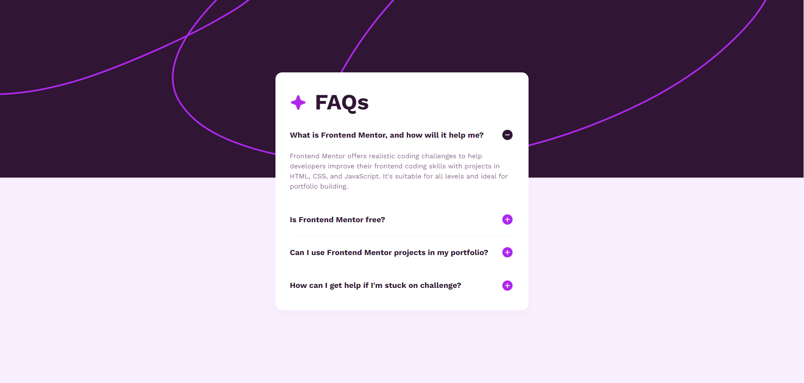

# Frontend Mentor - FAQ accordion solution

This is a solution to the [FAQ accordion challenge on Frontend Mentor](https://www.frontendmentor.io/challenges/faq-accordion-wyfFdeBwBz). Frontend Mentor challenges help you improve your coding skills by building realistic projects.

## Table of contents

- [Overview](#overview)
  - [The challenge](#the-challenge)
  - [Screenshot](#screenshot)
  - [Links](#links)
- [My process](#my-process)
  - [Built with](#built-with)
  - [What I learned](#what-i-learned)
  - [Continued development](#continued-development)
- [Author](#author)

## Overview

### The challenge

Users should be able to:

- Hide/Show the answer to a question when the question is clicked
- Navigate the questions and hide/show answers using keyboard navigation alone
- View the optimal layout for the interface depending on their device's screen size
- See hover and focus states for all interactive elements on the page

### Screenshot



### Links

- Solution URL: [Solution]('')
- Live Site URL: [Live Demo](https://your-live-site-url.com)

## My process

### Built with

- Semantic HTML5 markup
- CSS custom properties
- Flexbox
- CSS Grid
- Mobile-first workflow

### What I learned

Working on this project helped me reinforce my understanding of DOM traversal, event delegation, CSS responsiveness, and modular design. I learned how to create an accessible and interactive FAQ accordion using vanilla JavaScript and semantic HTML, with a responsive layout powered by CSS custom properties and media queries.

Instead of attaching individual event listeners to each question, I used event delegation to manage all clicks from the parent `.faq-body` container. This keeps the code clean and scalable.

```javascript
faqItem.addEventListener('click', function (event) {
    const faqHeader = event.target.closest('.faq-item-header');

    if (!faqHeader) return;

    faqHeader.nextElementSibling.classList.toggle('faq-open');
    faqHeader.nextElementSibling.classList.contains('faq-open')
        ? faqHeader.querySelector('img').src = 'assets/images/icon-minus.svg'
        : faqHeader.querySelector('img').src = 'assets/images/icon-plus.svg';
});
```

### Continued development

Moving forward, my primary focus is on writing clean, reusable code and building applications with a component-based architecture. I aim to deepen my understanding of modern JavaScript, particularly:

- `Promises` and `async/await` for handling asynchronous operations
- The `Proxy` object and meta-programming techniques
- Object-oriented programming, including the `prototype` chain and ES6 `classes`

In addition, I want to continue refining my approach to creating accessible, semantic HTML and implementing modern UI/UX design patterns that enhance both usability and maintainability.

## Author

- Website - [Waiwhakaira Falwasser](https://github.com/waifal)
- Frontend Mentor - [@waifal](https://www.frontendmentor.io/profile/waifal)
